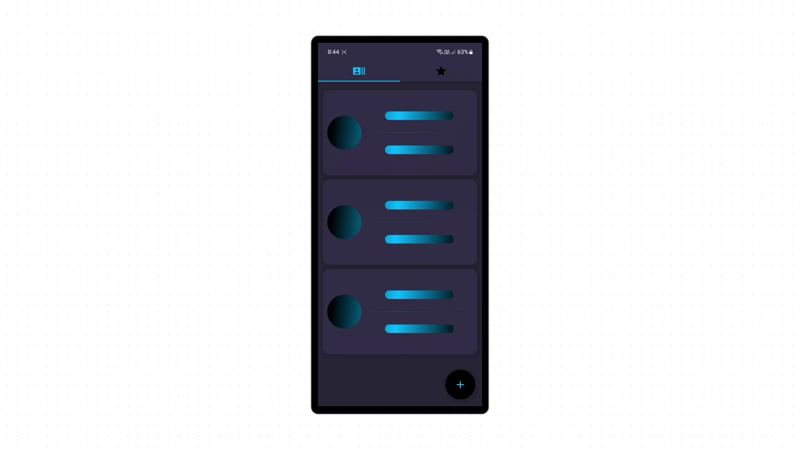

# friends_app

This is a Flutter app example to demonstrate data CRUDing and State Management.

And [here](https://medium.com/@hazem.monir/a5ac7f0f8745) is an article on medium.com of how this app is built.

